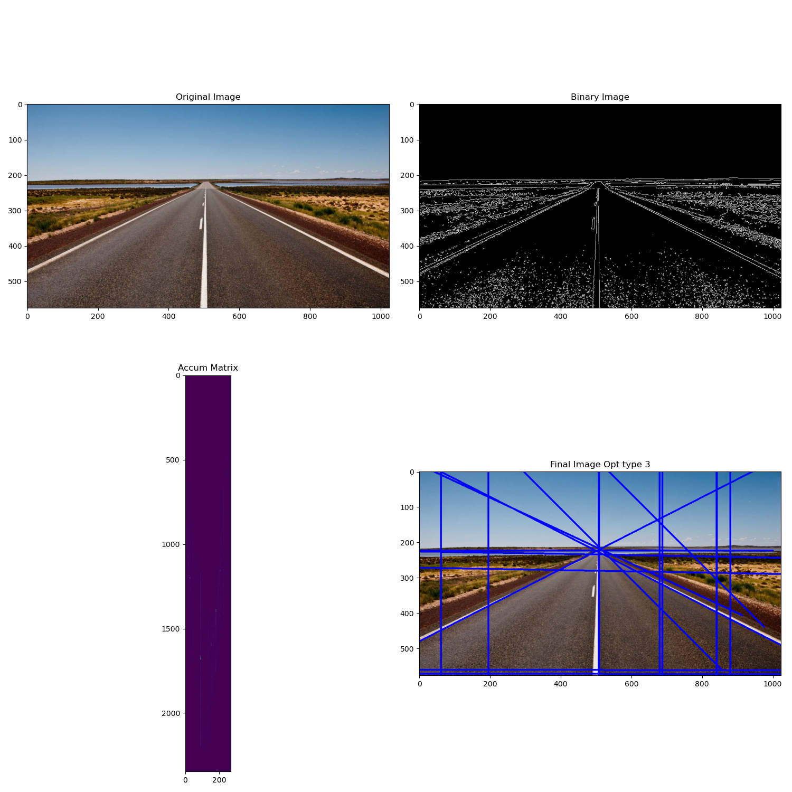
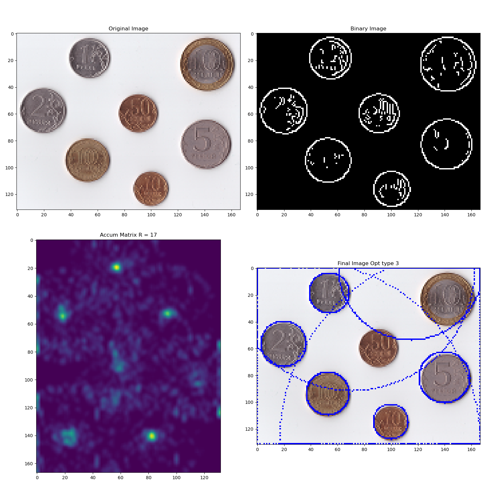

In this project implemented HoughTransform for detect lines,circles and ellipse

Line search has the following modifications:
+ Random selection of points
+ Use random pairs of points and determine the parameters of a straight line passing through them.
+ Using the gradient direction to calculate the angle in a straight line equation

Circle search has the following modifications:
+ Random selection of points
+ Use random pairs of points to calculate the center of the circle and the radius
+ Using the gradient direction to determine the line on which the center of the circle is located

Ellipse search is realized paper: https://ieeexplore.ieee.org/document/1048464

